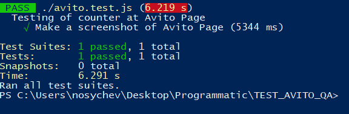

# Инструкция по выполнению тест кейсов

## Запуск через PowerShell на Windows.
1. Зайдите в корневую папку проекта. 
2. Зажмите Shift + нажмите правую кнопку мыши. 
3. В контекстном меню выберите "Открыть окно PowerShell здесь". 
4. В панели управления пропишите команду: 
   >npm test      
5. Увидите результаты теста: 
   
6. Скриншоты можно найти в папке output.

## Запуск через Terminal на Mac.
1. Зайдите в корневую папку проекта. 
2. На компьютере Mac выполните одно из следующих действий: 
- Нажмите значок Launchpad  в панели Dock, введите «Терминал» в поле поиска и нажмите значок Терминала. 

* В окне Finder  откройте папку «Программы/Утилиты» и дважды нажмите приложение «Терминал».. 
3. В панели управления пропишите команду: 
   >npm test      
4. Увидите результаты теста: 
   
5. Скриншоты можно найти в папке output.